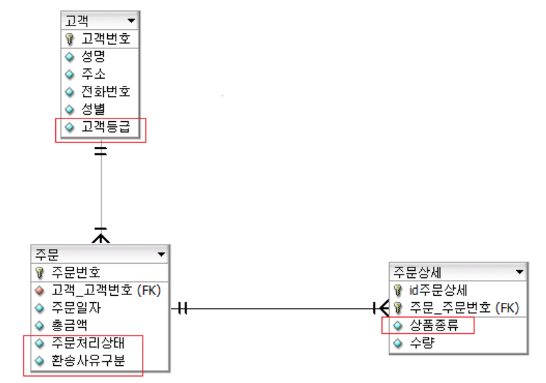
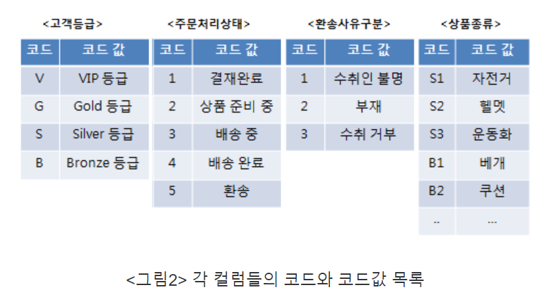
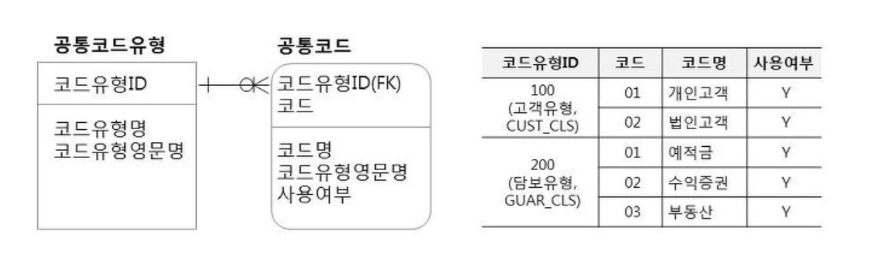

# MyNote

> 개발하면서 헷갈렸던 개념, 자주 나오는 개념, 트러블슈팅 정리하고자 함.

# 트러블슈팅

**JSP web.xml 파일 &설정**

* JSP2.3 웹프로그래밍 책을 참고하면서 web.xml 파일을 설정하다가 밑에 해당하는 에러가 발생했다.

* org.xml.sax.SAXParseException; systemId: file:/D:/Workspace/.metadata/.plugins/org.eclipse.wst.server.core/tmp0/wtpwebapps/Chap20/WEB-INF/web.xml; lineNumber: 13; columnNumber: 82; "characterEncoding" 엔티티에 대한 참조는 ';' 구분자로 끝나야 합니다.

```java
// Before
jdbcUrl=jdbc:mysql://localhost:3306/guestbook?useUnicode=true&characterEncoding=utf8&useSSL=false&serverTimezone=UTC

// After
jdbcUrl=jdbc:mysql://localhost:3306/guestbook?useUnicode=true&amp;characterEncoding=utf8&amp;useSSL=false&amp;serverTimezone=UTC

& : &amp;
< : &lt;
> : &gt;
‘ : &apos;
” : &quot;
```

* 알고보니 web.xml에는 & 문자를 사용할 수 없다는 간단한 문제였다.
* web.xml에는 특수문자를 사용하지 못하니 & 은 &amp; 으로 적어주어야한다.
* 위의 특수기호들(&, >, <, ', ") 은 메모해두고 필요할 때 사용하자.

# CSS

**padding이 max-width 계산에 포함되지 않는 경우**

* padding은 내부 영역에만 적용되어 박스 모델의 너비 계산에는 포함되지 않습니다.
* 따라서, padding은 이와 별도로 고려해야합니다.

* input text가 max-width 를 해도 계속 범위에서 벗어나서 아래 명령어를 적어줬더니 정상 작동했다.
* box-sizing: border-box; 


# 디자인 패턴

* 디자인 패턴은 개발하면서 발생하는 반복적인 문제들을 OOP 4대 특성(캡슐화, 상속, 추상화, 다형성)과 SOLID 설계 원칙을 기반으로 구현되어있는 패턴들입니다.

## 1. 싱글톤 패턴

* 어떠한 클래스가 유일하게 1개만 존재 할 때 사용합니다.
* 주로 서로 자원을 공유할 때 사용하며, 실물 세계에서는 프린터, 프로그래밍에서는 TCP Socket 통신에서 서버와 연결된 connect 객체에 주로 사용합니다.

```java
package singleton;

public class SocketClient {

	// 싱글톤 패턴 - 자기 자신을 객체로 가지고 있는 것 
	private static SocketClient socketClient = null;
	
	// 기본 생성자로 만들 수 없도록 private 으로 설정
	private SocketClient() {
		
	}
	
	public static SocketClient getInstance() {
		
		if(socketClient == null) {
			socketClient= new SocketClient();
		}
		return socketClient;
	}
	
	public void connect() {
		System.out.println("connet");
	}
}
```

* 자기 자신을 객체로 가지고 있는 싱글톤 패턴 클래스를 생성합니다.
* 생성할 때는 기본생성자에 접근하여 데이터를 변경할 수 없도록 private 으로 설정합니다.
* 객체를 생성할 때는 static 메서드인 getInstance 를 통해 null 파악 유무 파악 후 객체를 생성하게 됩니다.

```java
package singleton;

public class AClazz {

	private SocketClient socketClient;
	
	public AClazz() {
		this.socketClient = socketClient.getInstance();
	}
	
	public SocketClient getSocketClient() {
		return this.socketClient;
	}
}

package singleton;

public class BClazz {

	private SocketClient socketClient;
	
	public BClazz() {
		this.socketClient = SocketClient.getInstance();
	}
	
	public SocketClient getSocketClient() {
		return this.socketClient;
	}
}


import singleton.AClazz;
import singleton.BClazz;
import singleton.SocketClient;

public class Main {
	public static void main(String[] args){

		AClazz aClazz = new AClazz();
		BClazz bClazz = new BClazz();
		
		SocketClient aClient = aClazz.getSocketClient();
		SocketClient bClient = bClazz.getSocketClient();
		
		System.out.println("두 객체 동일한가?");
		System.out.println(aClient.equals(bClient));
	}
}

```

* A와 B 클래스 생성 후에 equals 메서드를 통해 console에 찍어보면 true 결과값이 나옵니다.
* 싱글톤 패턴을 사용해서 사용하는 것이 아닌 각각 기본 생성자를 통해 객체를 생성하면 false 결과값이 나옵니다.

## 2. 어뎁터 패턴

* Adapter 패턴은 실생활에서 100v를 220v 를 변경하는 돼지코 변환기를 예로 들 수 있습니다.
* **호환성이 없는 기존 클래스의 인터페이스를 변환하여 재사용** 할 수 있도록 합니다.
* SOLID 중에서 **개방폐쇄 원칙(OCP)** 를 따릅니다.

```java
package adapter;

public class HairDryer implements Electronic110V{

	@Override
	public void powerOn() {
		System.out.println("헤어 드라이기 110V On");
	}
}

package adapter;

public class AirConditioner implements Electronic220V{

	@Override
	public void connect() {
		System.out.println("에어컨 220V On");
	}
}


public class Cleaner implements Electronic220V{

	@Override
	public void connect() {
		System.out.println("청소기 220V On");
	}
}

```

* 헤어드라이기만 110V 를 쓴다고 가정하고 각각의 사물들의 클래스를 생성합니다.

```java
public interface Electronic220V {

	void connect();
}

public interface Electronic110V {

	void powerOn();
}
```

* 220V와 110V 인터페이스를 생성합니다.

```java
package adapter;

public class SocketAdapter implements Electronic110V{

	private Electronic220V electronic220v;
	
	public SocketAdapter(Electronic220V electronic220v) {
		this.electronic220v = electronic220v;
	}
	
	@Override
	public void powerOn() {
		electronic220v.connect();
	}
}
```

* 220V 전압을 사용하는 전자기기를 110V 전압에 맞게 연결하기 위해 SocketAdapter 클래스를 생성합니다.


```java
public class Main {
	public static void main(String[] args){

		HairDryer dryer = new HairDryer();
		connect(dryer);
		
		Cleaner cleaner = new Cleaner();
		//connect(cleaner); 110V는 사용할 수 없다. 이 떄 Adapter 패턴 사용.
		
		/**
		 * 220V인 청소기를 SocketAdapter 클래스의 생성자를 활용함으로써 110V의 Adapter에도 사용하고
		 * 자기 자신의 상태는 변경하지 않고 인터페이스 형태로 맞추는 형태로 사용합니다.
		 */
		Electronic110V adapter = new SocketAdapter(cleaner);
		connect(adapter);
		
		/**
		 * 110V 어뎁터밖에 없는데 220V인 에어컨을 사용하는 상황 가정하여 어뎁터를 사와야합니다.
		 * 객체 지향은 실물 그대로 반영하고자 한 것입니다.
		 * 110V를 사용하고자 할 때 Adapter를 사용하여 220V로 변경해줍니다. 
		 */
		AirConditioner airConditioner = new AirConditioner();
		Electronic110V airAdapter = new SocketAdapter(airConditioner);
		connect(airAdapter);
	}
	
	// 콘센트 connect
	public static void connect(Electronic110V electronic110v) {
		electronic110v.powerOn();
	}
}
```

* 이처럼 어뎁터 패턴은 한 인터페이스를 다른 인터페이스로 변환하는 역할을 합니다.
* 또한 자기 자신의 상태는 변경하지 않고 호환성 문제로 함께 작동할 수 없는 두 인터페이스 간의 통신을 가능하게 합니다.

## 3. 커맨드 패턴

* 하나의 객체를 통해 여러 객체들에 명령을 할 때 사용하는 패턴입니다.
* 요청을 캡슐화함으로써 여러 기능을 실행할 수 있는 재사용성이 높은 클래스를 설계하는 패턴입니다.

**커맨드 패턴 예제**

* 새로운 텍스트 편집기 앱을 개발한다고 가정해보자.

* 다양한 대화 상자들의 일반 버튼들에 사용할 수 있는 Button 클래스를 생성했다.
* 가장 간단한 방법은 버튼이 사용되는 각 위치에 자식 클래스를 만드는 것이다.
* 하지만 이 방법은 Button 클래스를 수정할 때마다 자식 클래스들의 코드가 망가질 위험이 존재한다.
* 또한 여러 클래스가 같은 기능을 구현하므로 코드 리팩토링을 해야될 필요성이 생긴다.

**해결 방법**

* 이를 해결하기 위해서는 사용자 인터페이스와 비즈니스 로직사이에 Button 클래스에 커맨드 객체에 대한 참조를 저장하는 단일 필드를 넣은 후 클릭 될 때 이 커맨드를 시행하도록 하면 해결이 가능합니다.

> 단일 실행 메서드로 **커맨드 인터페이스를 선언**하여 작업을 호출하는 클래스들로부터 분리할 수 있습니다. (단일 책임 원칙)

> 기존 클라이언트 코드를 손상하지 않고 새 커맨드들을 도입할 수 있습니다. (개방/폐쇄 원칙)

**한 줄 설명**

> 즉, 커맨드 패턴은 Servlet내 Model 로직에서 공통으로 구현할 Handler interface를 선언함으로써 알맞은 로직 코드를 구현하고 사용할 정보를 저장한 다음에 결과를 보여줄 JSP URI를 리턴한다.  

# Database

**공통코드 테이블 설계**

* DB 모델링 실습 중 공통 테이블을 만들게 되어 정리하고자함. 모든 데이터 모델에는 코드 테이블이 존재합니다. 이를 어떻게 공통코드 테이블로 만들고, 왜 만들어야되는지 생각해보자.



* 위의 간단한 그림에서 볼 수 있듯이 고객등급, 주문처리상태는 대표적인 코드 대상입니다.
* 코드는 VIP 등급 대신에 'V'라는 한 글자를 쓰는 것 처럼, 매번 한글 또는 영문으로 쓰면 자리를 많이 차지하기도 하고 조회쿼리 SQL문을 작성할 때도 번거로운 문제점이 있습니다.
* 따라서 만들고 나면 **일일이 한글명 영문명으로 작성해야 하는 귀찮음 해결 + 코드로 정하지 않은 값들은 아예 들어갈 수 없는 장점**도 존재합니다.



* 코드 테이블을 설계 한 후의 데이터 모델입니다.
* 하지만 테이블만 많아지고 복잡해졌습니다. 이러한 문제를 해결하기 위한 것이 공통 코드 테이블입니다. 코드와 코드값으로 구성된 코드들을 모아서 하나의 테이블에서 관리하는 것입니다.

* 공통 코드 테이블을 만드는 방법은 여러 가지 방법이 있습니다.

1. 코드유형 간 포함관계
2. 코드유형, 코드 간 종속 관계
3. 코드유형 + 코드 형태 구성
4. 코드유형 + 코드 엔티티 형태
5. 공통코드유형과 공통코드 형태

* 5. 공통코드유형과 공통 코드 형태가 가장 일반적인 방법이기에 5번만 자세하게 알아보겠습니다.



* 식별자가 코드유형ID, 코드 조합으로 구성되어있다.
* SQL로 고객유형코드를 조회 시 코드유형ID = '100' 조건을 추가하여 사용한다.
* 코드유형ID대신 코드유형영문명 = 'CUST_CLS' 처럼 코드유형 영문명을 사용하면 코드유형ID보다 직관적이어서 코딩 생산성을 높일 수 있습니다.

