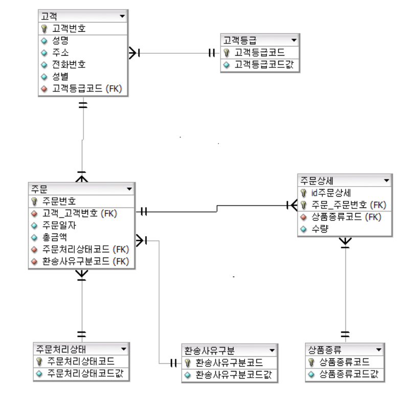

# MyNote

> 개발하면서 헷갈렸던 개념, 자주 나오는 개념, 트러블슈팅 정리하고자 함.

# 트러블슈팅

**JSP web.xml 파일 &설정**

* JSP2.3 웹프로그래밍 책을 참고하면서 web.xml 파일을 설정하다가 밑에 해당하는 에러가 발생했다.

* org.xml.sax.SAXParseException; systemId: file:/D:/Workspace/.metadata/.plugins/org.eclipse.wst.server.core/tmp0/wtpwebapps/Chap20/WEB-INF/web.xml; lineNumber: 13; columnNumber: 82; "characterEncoding" 엔티티에 대한 참조는 ';' 구분자로 끝나야 합니다.

```java
// Before
jdbcUrl=jdbc:mysql://localhost:3306/guestbook?useUnicode=true&characterEncoding=utf8&useSSL=false&serverTimezone=UTC

// After
jdbcUrl=jdbc:mysql://localhost:3306/guestbook?useUnicode=true&amp;characterEncoding=utf8&amp;useSSL=false&amp;serverTimezone=UTC

& : &amp;
< : &lt;
> : &gt;
‘ : &apos;
” : &quot;
```

* 알고보니 web.xml에는 & 문자를 사용할 수 없다는 간단한 문제였다.
* web.xml에는 특수문자를 사용하지 못하니 & 은 &amp; 으로 적어주어야한다.
* 위의 특수기호들(&, >, <, ', ") 은 메모해두고 필요할 때 사용하자.

# CSS

**padding이 max-width 계산에 포함되지 않는 경우**

* padding은 내부 영역에만 적용되어 박스 모델의 너비 계산에는 포함되지 않습니다.
* 따라서, padding은 이와 별도로 고려해야합니다.

* input text가 max-width 를 해도 계속 범위에서 벗어나서 아래 명령어를 적어줬더니 정상 작동했다.
* box-sizing: border-box; 


# 디자인 패턴

* 디자인 패턴은 개발하면서 발생하는 반복적인 문제들을 OOP 4대 특성(캡슐화, 상속, 추상화, 다형성)과 SOLID 설계 원칙을 기반으로 구현되어있는 패턴들입니다.

## 커맨드 패턴

* 하나의 객체를 통해 여러 객체들에 명령을 할 때 사용하는 패턴입니다.
* 요청을 캡슐화함으로써 여러 기능을 실행할 수 있는 재사용성이 높은 클래스를 설계하는 패턴입니다.

**커맨드 패턴 예제**

* 새로운 텍스트 편집기 앱을 개발한다고 가정해보자.

* 다양한 대화 상자들의 일반 버튼들에 사용할 수 있는 Button 클래스를 생성했다.
* 가장 간단한 방법은 버튼이 사용되는 각 위치에 자식 클래스를 만드는 것이다.
* 하지만 이 방법은 Button 클래스를 수정할 때마다 자식 클래스들의 코드가 망가질 위험이 존재한다.
* 또한 여러 클래스가 같은 기능을 구현하므로 코드 리팩토링을 해야될 필요성이 생긴다.

**해결 방법**

* 이를 해결하기 위해서는 사용자 인터페이스와 비즈니스 로직사이에 Button 클래스에 커맨드 객체에 대한 참조를 저장하는 단일 필드를 넣은 후 클릭 될 때 이 커맨드를 시행하도록 하면 해결이 가능합니다.

> 단일 실행 메서드로 **커맨드 인터페이스를 선언**하여 작업을 호출하는 클래스들로부터 분리할 수 있습니다. (단일 책임 원칙)

> 기존 클라이언트 코드를 손상하지 않고 새 커맨드들을 도입할 수 있습니다. (개방/폐쇄 원칙)

**한 줄 설명**

> 즉, 커맨드 패턴은 Servlet내 Model 로직에서 공통으로 구현할 Handler interface를 선언함으로써 알맞은 로직 코드를 구현하고 사용할 정보를 저장한 다음에 결과를 보여줄 JSP URI를 리턴한다.  

# Database

**공통코드 테이블 설계**

* DB 모델링 실습 중 공통 테이블을 만들게 되어 정리하고자함. 모든 데이터 모델에는 코드 테이블이 존재합니다. 이를 어떻게 공통코드 테이블로 만들고, 왜 만들어야되는지 생각해보자.


* 위의 간단한 그림에서 볼 수 있듯이 고객등급, 주문처리상태는 대표적인 코드 대상입니다.
* 코드는 VIP 등급 대신에 'V'라는 한 글자를 쓰는 것 처럼, 매번 한글 또는 영문으로 쓰면 자리를 많이 차지하기도 하고 조회쿼리 SQL문을 작성할 때도 번거로운 문제점이 있습니다.
* 따라서 만들고 나면 **일일이 한글명 영문명으로 작성해야 하는 귀찮음 해결 + 코드로 정하지 않은 값들은 아예 들어갈 수 없는 장점**도 존재합니다.



* 코드 테이블을 설계 한 후의 데이터 모델입니다.
* 하지만 테이블만 많아지고 복잡해졌습니다. 이러한 문제를 해결하기 위한 것이 공통 코드 테이블입니다. 코드와 코드값으로 구성된 코드들을 모아서 하나의 테이블에서 관리하는 것입니다.

* 공통 코드 테이블을 만드는 방법은 여러 가지 방법이 있습니다.

1. 코드유형 간 포함관계
2. 코드유형, 코드 간 종속 관계
3. 코드유형 + 코드 형태 구성
4. 코드유형 + 코드 엔티티 형태
5. 공통코드유형과 공통코드 형태

* 5. 공통코드유형과 공통 코드 형태가 가장 일반적인 방법이기에 5번만 자세하게 알아보겠습니다.


* 식별자가 코드유형ID, 코드 조합으로 구성되어있다.
* SQL로 고객유형코드를 조회 시 코드유형ID = '100' 조건을 추가하여 사용한다.
* 코드유형ID대신 코드유형영문명 = 'CUST_CLS' 처럼 코드유형 영문명을 사용하면 코드유형ID보다 직관적이어서 코딩 생산성을 높일 수 있습니다.
